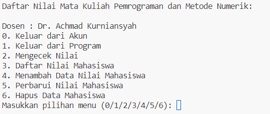
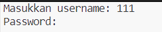
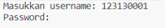
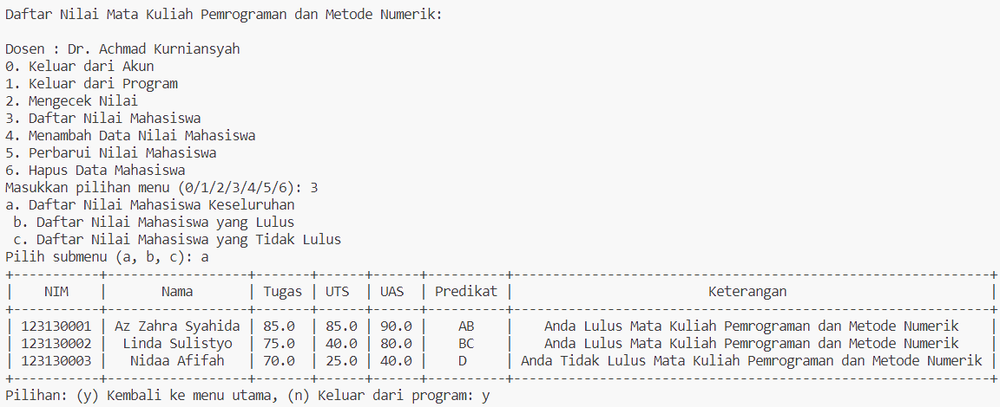
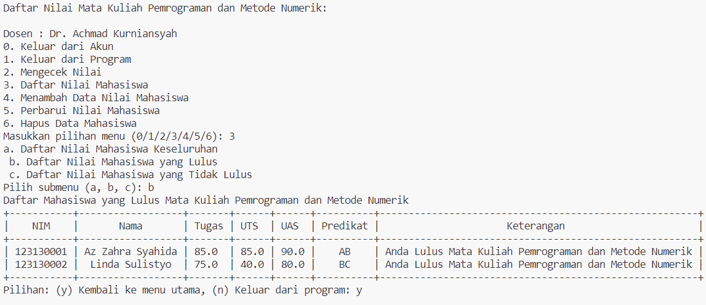
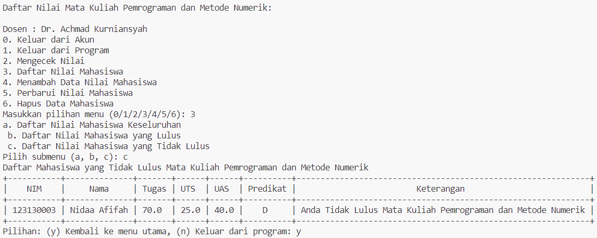
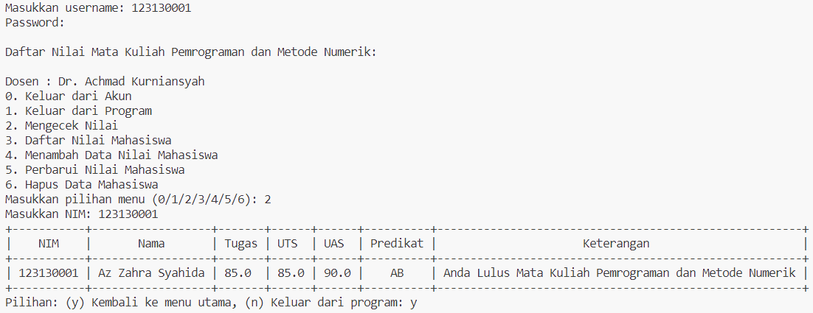
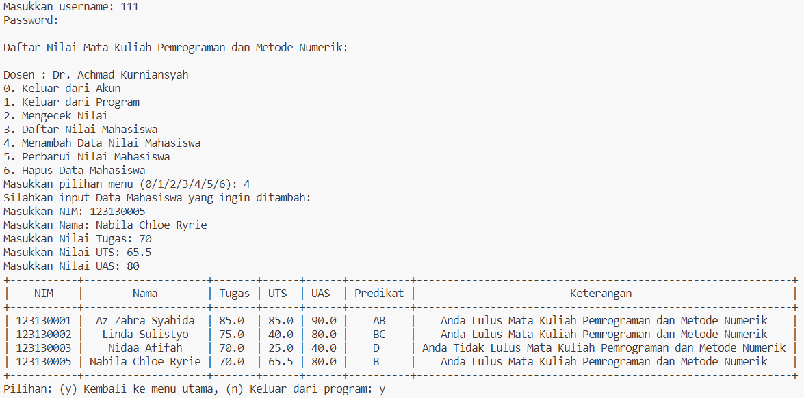
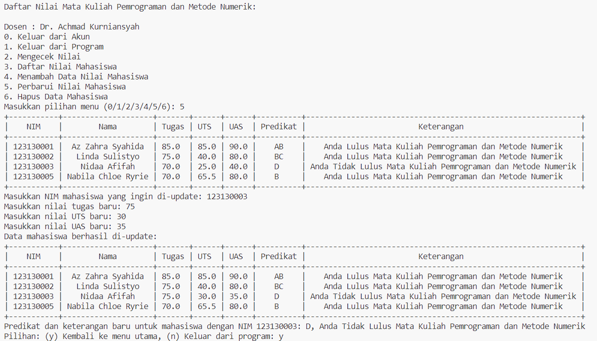
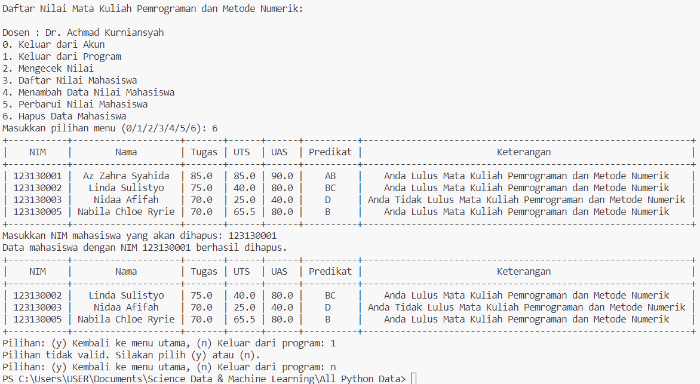

# **Capstone code explanation.**
This application was developed as my first capstone project while participating in a Data Science course at Purwadhika. Its main purpose is to demonstrate CRUD (Create, Read, Update, Delete) functionality. Keep in mind that this is a small-scale application created as part of my learning journey in data science. While it may have some imperfections and may not perfectly mimic a real-world workflow, I've put in my best effort.

This programming project is focused on the management of a student's grade records for a specific course, utilizing fictional variables and data. In this context, we are simulating a scenario where we keep track of students' academic performance, but the information is entirely based on fictitious data. This allows us to practice coding and data handling skills in a controlled environment, without involving real student information.

The programming is conducted using Indonesian language data. In this context, it means that the coding and documentation are done using the Indonesian language for variables, comments, and user interfaces. This approach helps us gain experience in coding and working with programming concepts in a language-specific context while using fictitious data for practice and learning purposes.

---

## **Introduction to the App**
Welcome to the 'Programming and Numerical Methods Course Grade List' program!
A simple application to view the list of student grades in the "Programming and Numerical Methods" course.
In this simple application, there are several features:

1. Login and Logout as a student/teacher.
2. Viewing student grades, either as a whole, based on those who passed, those who failed, or by entering a specific student's ID (NIM).
3. Adding student grade records.
4. Updating student grades.
5. Deleting student grade records.

Here is the screenshot of the main menu:

##### 
^Students have limited access and can only access menus 0, 1, 2, and 3. Lecturer have unrestricted access to all menu options. 

---

## **Features**
Let's take a closer look at each feature in this program:

### **1. Login and Logout as a student/teacher.**

This feature allows users to log in to the system, where they can access their respective accounts as students or lecturer. It provides authentication to ensure that only authorized individuals can access the system. After using the system, users can log out to secure their accounts.

**Lecturer Login**: Lecturer can access the system by using the username "111" and the password "dosen" (without quotation marks). This ensures that only teaching staff with the correct credentials can log in as lecturer.

**Student Login**: Students, on the other hand, can log in using usernames ranging from "123130001" to "123130150," corresponding to their unique student IDs. For example, if a student's username is "123130001," their password would be "mahasiswa0001" (without quotation marks), with the four-digit student ID (NIM) appended to "mahasiswa." This login process allows students to access their accounts securely.

After utilizing the system, users can log out to safeguard the privacy and security of their accounts.

**Logout by Selecting Menu 0**: To log out of the system and ensure the privacy and security of their accounts, users can simply select menu option "0." This menu option triggers the logout process, which safely terminates their active session within the application.

### **2. Viewing student grades, either as a whole, based on those who passed, those who failed, or by entering a specific student's ID (NIM).**

To view the overall list of student grades.

To view the list of students who passed the course.

To view the list of students who failed the course.

To view a specific student's grade by entering their student ID (NIM).

`The data in the screenshot originates from the initial dataset created for programming purposes.` 

### **3. Adding student grade records.**

This menu allows the user to input and store information for new students, ensuring that the NIM is unique and falls within the specified range. It also computes grade predicates and descriptions for the new data and displays the updated dataset.

`The entered NIM falls within the correct range (123130001-123130150), ensuring that it's a valid student ID.`
### **4. Updating student grades.**

This menu allows the user to update the scores and corresponding grade information for a specific student within the dataset, ensuring that the data is accurate and up to date.

### **5. Deleting Current Employee Data**

This menu allows the user to delete a student's record from the dataset based on their NIM. It verifies the existence of the NIM in the dataset and, if found, removes all associated data, ensuring the dataset remains accurate and up to date.

---

